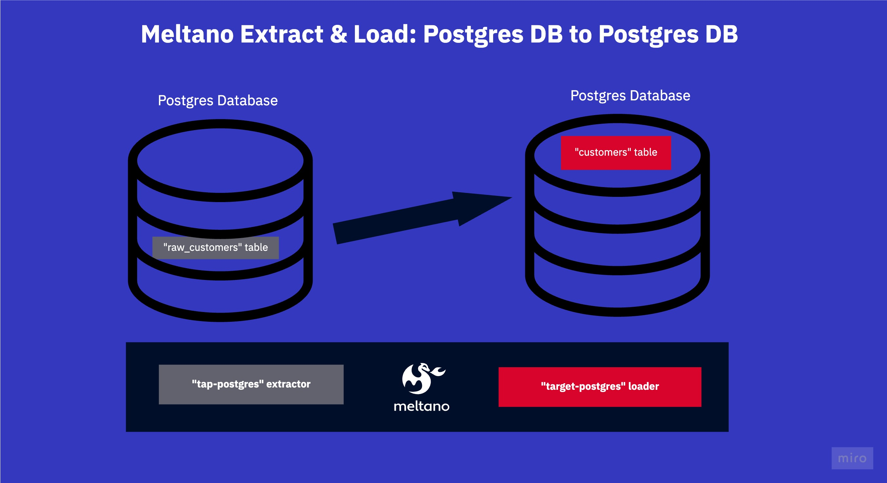

# Meltano Example Projects: Extract & Load (EL) (Postgres => Postgres) Sandbox
This project extends the ```jaffle shop``` sandbox project created by [DbtLabs](https://github.com/dbt-labs/jaffle_shop) for the data built tool ```dbt```. 

This meltano project sources one table from one postgres database and dumps it into another postgres database.


## What is this repo?
_What this repo is:_

A self-contained sandbox meltano project. Useful for testing out scripts, yaml configurations and understanding some of the core meltano concepts.

_What this repo is not:_

This repo is not a tutorial or an extensive walk-through. It contains some bad practices. To make it self-contained, it contains a AWS S3 mock, as well as a dockerized Postgres database. 

We're focusing on simplicity here!

## What's in this repo?
This repo contains two local postgres databases, one as source with the raw customer data inside, and another one as target.

The meltano project extracts this table using the tap-postgres ```extractor```, and loads them into the ```PostgreSQL``` database using
the loader ```target-postgres```.

## How to run this project?
Using this repository is really easy as it all runs inside docker via [batect](https://batect.dev/), a light-weight wrapper around docker. 

### Run with batect
We [batect](https://batect.dev/) because it makes it possible for you to run this project without even installing meltano. [Batect requires Java & Docker to be installed to run](https://batect.dev/docs/getting-started/requirements). 

The repository has a few configured "batect tasks" which essentially all spin up docker or docker-compose for you and do things inside these containers.

Run  ```./batect --list-tasks ``` to see the list of commands.

```batect launch_source_target``` for instance will launch two docker containers both with a local postgres database and seed the source database with initial data.

Batect automatically tears down & cleans up after the task finishes.

### Run the project

1. Launch the mock endpoints in a separate terminal window ```./batect launch_source_target```.

2. Launch meltano with batect via ```./batect melt```.
2.1. Alternatively you can use your local meltano, installed with ```pip install meltano```. (The mocks will still work.)

3. Run ```meltano install``` to install the two plugins, the PostgreSQL loader & extractor as specified in the [meltano.yml](new_project/meltano.yml).

Here is an extract from the [meltano.yml](new_project/meltano.yml):

```yaml
...
plugins:
  extractors:
  - name: tap-postgres
    variant: transferwise
    pip_url: pipelinewise-tap-postgres
    config:
      host: host.docker.internal
      port: 5433
      user: admin
      password: password
      dbname: demo_source
      default_replication_method: FULL_TABLE
    select:
      - public-raw_customers.* # select all three attributes from the public schema inside the raw_customers table. 
                              # use meltano select tap-postgres --list --all to view all selectable attributes

  loaders: 
  - name: target-postgres
    variant: transferwise
    pip_url: pipelinewise-target-postgres
    config:
      host: host.docker.internal
      port: 5432
      user: admin
      password: password
      dbname: demo_target
```

4. Finally, run ```meltano run tap-postgres target-postgres``` to execute the extraction and loading. 

5. Check inside the local database afterwards to see that your data has arrived, use the connection data below.

(Note: it really is port 5432, port 5433 host the local source database, but we want to check that the data arrived in the target database!)

```yaml
...
      host: localhost
      port: 5432
      user: admin
      password: password
      dbname: demo_target
```

